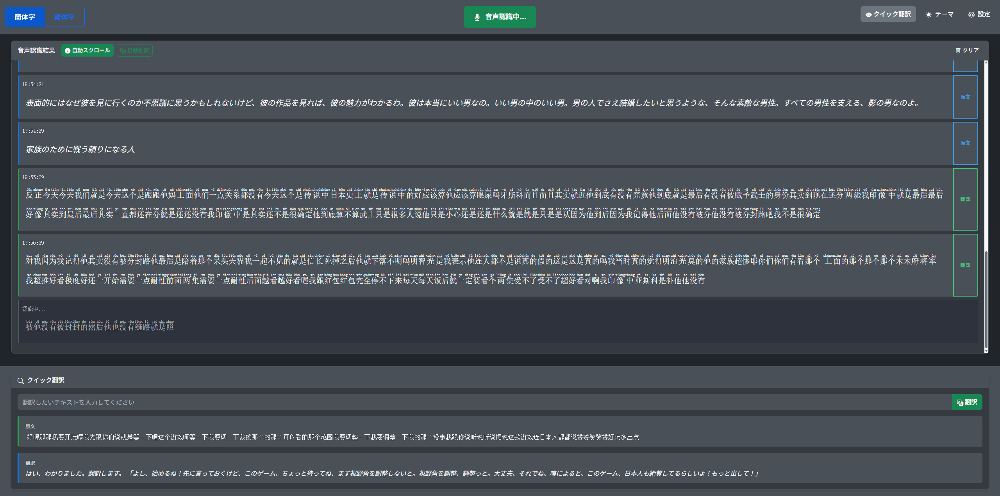

# Chinese Speech to Text

中国語VTuber配信などの音声をリアルタイムで認識・翻訳する個人用Webアプリケーションです。

## スクリーンショット

*音声認識とリアルタイム翻訳画面*

## 特徴

- 🎤 リアルタイム中国語音声認識（簡体字・繁体字対応）
- 🌏 Google Gemini AIによる高精度な中国語→日本語翻訳
- 📝 ピンイン表示機能（読み方学習に便利）
- ⚡ クイック翻訳（テキスト選択で即座に翻訳）
- 🎨 ダークモード対応
- 💾 設定の自動保存
- 📱 レスポンシブデザイン

## 想定用途

**個人用途限定**：中国語VTuber配信、中国語動画、語学学習などの音声理解支援

## 必要な環境

- **ブラウザ**: Chrome、Firefox、Edge（音声認識API対応）
- **OS**: Windows、macOS、Linux
- **音声入力**: マイクまたは仮想音声デバイス

## セットアップ

### 1. Google Gemini API キーの取得

1. [Google AI Studio](https://aistudio.google.com/) にアクセス
2. Googleアカウントでログイン
3. 「Get API Key」をクリックして新しいAPIキーを作成
4. APIキーをコピーして保存

### 2. 音声入力の設定

#### PC内部音声を認識させる場合（VTuber配信など）

**Voicemeeter Banana** の使用を推奨：

1. [Voicemeeter Banana](https://vb-audio.com/Voicemeeter/banana.htm) をダウンロード・インストール
2. 設定手順：
   - A1: 物理スピーカー（イヤホン・ヘッドフォン）
   - Virtual Input: 配信音声の入力先
   - WDM: Virtual Input を選択して B1 にルーティング
3. システム音声出力をVoicemeeter Inputに設定
4. ブラウザでマイクの権限を「Voicemeeter Output」に設定

#### 直接マイクを使用する場合

- 物理マイクをPCに接続
- ブラウザでマイクアクセスを許可

### 3. アプリケーションの起動

1. プロジェクトをダウンロード
2. `index.html` をブラウザで開く
3. 設定ボタンから Gemini API キーを入力
4. 言語選択（簡体字/繁体字）を選択
5. 「開始音声認識」ボタンで音声認識開始

## 使い方

### 基本操作

1. **音声認識開始**: 緑色のマイクボタンをクリック
2. **言語切り替え**: ヘッダーの「簡体字」「繁体字」ボタン
3. **自動翻訳**: 音声認識と同時に翻訳を実行
4. **クイック翻訳**: 認識されたテキストを選択して即座に翻訳

### 翻訳機能

- **自動翻訳**: 音声認識完了時に自動で翻訳実行
- **選択翻訳**: テキストを選択すると翻訳エリアに結果表示
- **手動翻訳**: 翻訳エリアで任意のテキストを翻訳
- **翻訳スタイル**: 設定で翻訳の口調・スタイルをカスタマイズ

### 設定項目

- **Gemini APIキー**: 翻訳機能に必要
- **Geminiモデル**: 翻訳精度と速度のバランス
- **最大表示行数**: 認識結果の保持数（0=無制限）
- **翻訳スタイル**: 翻訳時の口調指定（任意）

## 対応モデル

| モデル | 特徴 |
|--------|------|
| Gemini 2.5 Flash-Lite | 高速・軽量（推奨） |
| Gemini 2.0 Flash-Lite | バランス型・軽量 |
| Gemini 2.0 Flash | 標準・安定 |
| Gemini 1.5 Flash | 従来型・実績 |

## 注意事項

- **個人利用のみ**: 商用利用は禁止
- **API利用料**: Google Gemini APIの使用料は自己負担
- **精度について**: 音声認識精度は環境や話者により変動
- **繁体字中国語**: 技術的な都合により音声認識が不完全です（ピンイン表記は簡体字式）
- **プライバシー**: 音声データはGoogle音声認識APIに送信されます

## トラブルシューティング

### 音声認識が動作しない

- ブラウザのマイク権限を確認
- 正しい音声入力デバイスが選択されているか確認
- Voicemeeter の設定とルーティングを確認

### 翻訳が動作しない

- Gemini APIキーが正しく設定されているか確認
- インターネット接続を確認
- APIキーの使用制限を確認

### 音声が途切れる

- 音声入力レベルを調整
- ブラウザのタブがアクティブであることを確認
- PCの性能とネットワーク状況を確認

## 技術スタック

- **フロントエンド**: HTML5, CSS3, JavaScript (ES6+)
- **UI**: Bootstrap 5, Bootstrap Icons
- **音声認識**: Web Speech API
- **翻訳API**: Google Gemini AI
- **ピンイン**: pinyin-pro ライブラリ

## ライセンス

個人利用のみ許可。商用利用禁止。

### 使用ライブラリ
- [Bootstrap 5](https://getbootstrap.com/) - MIT License
- [Bootstrap Icons](https://icons.getbootstrap.com/) - MIT License
- [jQuery](https://jquery.com/) - MIT License
- [pinyin-pro](https://github.com/zh-lx/pinyin-pro) - MIT License

## 免責事項

本ツールの使用により生じた問題について作者は責任を負いません。自己責任でご利用ください。

---

**⚠️ 注意**: このツールは個人の語学学習・エンターテイメント目的でのみ使用してください。